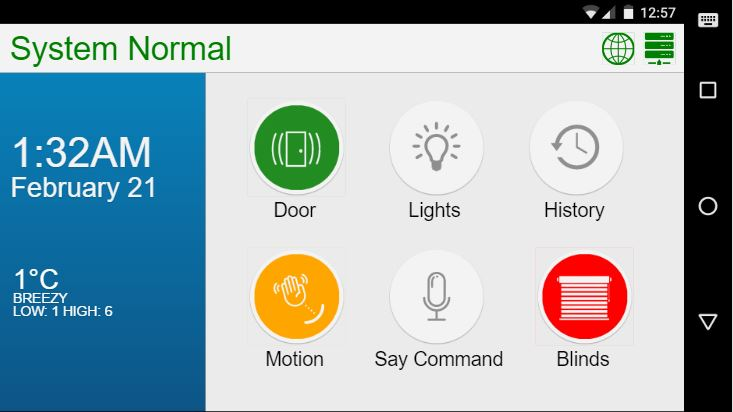
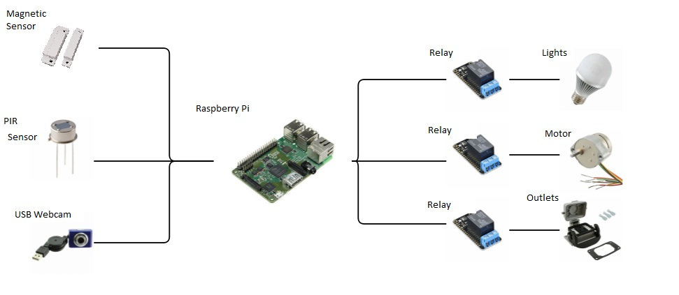

Tim Pi Home Monitoring
===================

A DIY home monitoring system made of the Raspberry Pi. It currently has the ability to control lights, outlets, and blinds. 

----------

Setup
-------------

**Hardware**

 - Raspberry Pi
 - USB Webcam
 - Door magnetic sensor
 - Relay modules
 - PID Sensor

 

**Software Setup**

 6. Clone this repository into your Pi by using 
`git clone https://github.com/Timothylock/Tim-Pi-Home-Monitoring.git`

 7. Make sure nodejs is installed onto the pi and everything is updated. You can find a guide of installing nodejs onto your particular model on the internet.
 8. install the node modules by running
 ` npm install `
 

 9. Follow the guide [here](https://github.com/fivdi/pigpio) to install pigpio module for node
 10. Run the configurator to tell the server which pins what sensors/relays are plugged into
 ` python configure.py `

 11. You can now run the server
 ` node server.js `
 

 12. You can connect to the server by entering your Pi's IP address into any web browser

**Starting with the Pi**
You can set the server to start up along with the Pi. This is not a watchdog so if the server crashes, it will not be automatically restarted. Please check how to set up a watch dog on the internet. 

To start up with Pi, type

    sudo nano /etc/rc.local

and add

    cd /home/pi/Tim-Pi-Home-Monitoring/
    node server.js &

replacing the directory with your own of course. Don't forget the '&'! It makes the script run in the background rather than hanging the startup.

Not-so-frequent FAQ
-------------

## Why node? Why not ____?

The server used to be in Python (Flask), but I remade the server in NodeJS since I was taking a web development course at my university and really love the idea of asynchronousity for the server. 

## Where is feature X?

I always love adding new things, but I tend to add features that affect me more. If you have a great idea, feel free to fork this repo and to make a PR when you are done! 

## How many clients can it support at a time?

Right now the JS makes a GET reqquest every 50ms. I have tested this with 5 devices on a Pi 1 model B and it had no trouble processing all of the requests. If needed, you can go into the JS to increase the polling interval. 

## Can this integrate with my smart home hubs? Echo? 

Yup! This server emulates WeMo devices. That means each light/outlet pin and the blinds will all appear as seperate devices when your hub or Echo scans the network for WeMo devices. 

#### Alexa Instructions
1. Have Alexa scan for devices `Alexa scan for devices`
2. Once added, you can turn on and off pins by saying `Alexa turn bedroom lights on`, `Alexa, turn bedroom lights off`
